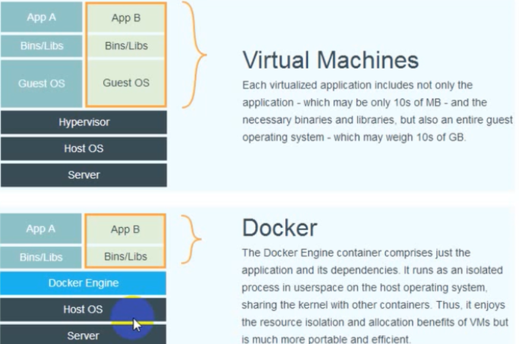

# docker简介
**docker是一个开源的应用容器引擎**，可以让开发人员把编写好的代码和运行代码所需要的环境打包进一个容器里，通过移植容器可以避免多次搭建环境以及代码在一台机器上可以运行而到了另一台机器上因环境问题报错。

**区分镜像和容器**
用户基于镜像来运行容器，可以把镜像和容器类比成类和对象


**docker、dockerfile与docker-compose区别**
docker是一个可以基于镜像创建容器的软件
dockerfile把手工安装docer镜像的过程变成一个配置文件脚本，以后只需要运行这个文件就可获得所需环境
docker-compose用于编排容器。通过编辑docker-composer.yml配置文件，可以一个命令启动多个需要不同参数配置的容器

**docker和虚拟机的区别**

简单来说docker不需要一个单独的客户机操作系统，而是借助了宿主机。（应该是这样）



# ubuntu下安装docker


ubuntu下安装docker，一条命令即可
`curl -sSL https://get.daocloud.io/docker | sh`


镜像加速，去阿里云拿加速地址
`https://cr.console.aliyun.com/cn-hangzhou/instances/mirrors`
```python
 $ sudo mkdir -p /etc/docker
 $ vim /etc/docker/daemon.json
 # 加入以下代码
 {
   "registry-mirrors": ["加速器地址"]
 }
 
 $ sudo systemctl daemon-reload
 $ sudo systemctl restart docker
```

# kali下安装docker

```python
curl -fsSL https://download.docker.com/linux/debian/gpg | sudo apt-key add -
```

```python
echo 'deb https://download.docker.com/linux/debian stretch stable'> /etc/apt/sources.list.d/docker.list
如果显示没有权限，就运行下面这条命令
echo "deb https://download.docker.com/linux/debian stretch stable"  | sudo tee -a /etc/apt/sources.list.d/docker.list
```

```python
apt-get install apt-transport-https  ca-certificates  curl  gnupg2  software-properties-common
```

```python
sudo apt-get update
```

```python
sudo apt install docker.io
如果报错用下面这条命令
apt-get install docker-ce
```

```python
docker --version
```

# docker基本命令

重启docker`systemctl restart docker`

停止运行docker`systemctl stop docker`

查看版本：`docker version`

列出本地的镜像：`docker images`

查找镜像：例`docker search ubuntu`

拉取镜像：`docker pull 镜像名[:版本]`

删除镜像：`docker rmi ubuntu`

创建交互式容器：`docker run -i -t --name=name1 centos /bin/bash`

> -i：交互式容器
> -t：tty终端
> -d：守护式容器
> --name：指定容器名称

查看正在运行的容器：`docker ps`

查看运行过的容器：`docker ps -a`

查看最后一次运行的容器：`docker ps -l`

退出当前容器：`exit`

创建守护式容器(不会自动登录进去)：`docker run -di --name=运行后的名字 镜像名字`
登录进去`docker exec -it 正在运行的容器名字 /bin/bash`
`ctrl+p+q`退出容器，但不关闭

创建容器并登录进去：`docker run -it --name=运行后的名字 镜像名字 /bin/bash`

也可以用`docker attach 容器名`

> attach 不会在容器中创建进程执行额外的命令，只是附着到容器上.
> exec会在运行的容器上创建进程执行新的命令。

停止运行容器：`docker stop 容器名字`

开启已有的容器：`docker start 容器名字`

> docker start 指定一个容器
> docker run 指定一个镜像

查看容器的详细信息：`docker inspect c1`

查看容器运行日志`docker logs c1`

删除容器：`docker rm 容器名称/容器id`，注意不能删除正在运行的容器

文件拷贝：
`docker cp 待拷贝的文件或目录 容器名称:容器目录`
`docker cp 容器名称:容器目录 带拷贝的文件或目录`

**目录挂载**
在**创建容器**的时候，将宿主机的目录与容器的目录进行映射，这样就可以通过修改宿主机的某个目录文件去影响容器
-v 宿主机目录:容器目录
`docker run -di --name=自定义容器名 -v /opt/:/usr/local/myhtml 镜像名`

>":"前面的目录是宿主机目录，后面的目录是容器内目录。

`docker exec -it 容器名 /bin/bash`

# docker搭建mysql、nginx、redis
**mysql**
`docker pull mysql:5.7`
`docker run -di --name=mysql -p 3306:3306 -e MYSQL_ROOT_PASSWORD=root mysql:5.7`

> -di 守护方式交互方式
> -p 3306:3306(端口映射-p 宿主机端口:容器端口)
> -e MYSQL_ROOT_PASSWORD=root设置环境变量
> mysql:5.7 镜像

`docker exec -it mysql /bin/bash`
`docker -u root -p root`

**nginx**
`docker pull nginx`
`docker run -di --name=nginx -p 80:80 nginx [可以创建的之后直接将容器文件挂载到宿主机某一目录]`

**redis**
`docker pull redis`
`docker run -di --name=redis -p 6379:6379 redis`

# 容器/镜像打包

可以通过scp命令将打包的镜像上传到其他服务器(机器) `scp xx.tar 其他服务器ip:/root/xx.tar`


-----
export容器打包：（**但最好还是用save存储打包**）
1、容器打包：`docker export -o /root/xx.tar t1`
2、导入容器：`docker import xx.tar mytomcat:mycersion`

---
容器保存为镜像
`docker commit 容器名字 新镜像名字`

save镜像打包：`docker save -o /root/xx.tar 新镜像名字`

导入镜像：`docker load -i /root/xx.tar`之后会产生一个新的镜像，之后一个正常使用

> 导出后再导入(exported-imported)的镜像会丢失所有的历史，而保存后再加载（saveed-loaded）的镜像没有丢失历史和层(layer)。这意味着使用导出后再导入的方式，你将无法回滚到之前的层(layer)，同时，使用保存后再加载的方式持久化整个镜像，就可以做到层回滚来回滚之前的层）。

# 搭建私有镜像仓库

**私有仓库本身也是一个镜像**

拉取私有仓库镜像`docker pull registry`

创建`docker run -di --name=registry -p 5000:5000 registry`
打开浏览器输入`http://自己ip：5000/v2/_catalog`，看到`{"repositories":[]}`
表示私有仓库搭建成功并且内容为空


修改`/etc/docker/daemon.json`，让docker信任私有仓库
添加`{"insecure-registries":["自己ip:5000"]}`

重启docker
`systemctl restart docker`

打标签
`docker tag jdk1.8(当前镜像名字) ip:5000/自己设定的标签名`

上传
`docker push ip:5000/自己设定的标签名`

**拉取私有仓库镜像**
先让docker信任私有仓库
修改`/etc/docker/daemon.json`添加`{"insecure-registries":["自己ip:5000"]}`
`docker pull 镜像名字`


# docker网络管理
查看docker网络：`docker network ls`

一、默认网络
在非集群环境下docker提供的默认网络
docker中默认网络分为bridge、host、none。
bridge可以与互联网通信，host和none不可以与外界网络通信
二、自定义网络
1、bridge
2、overlay network in swarm mode(swarm集群中的覆盖网络)
3、network plugin(定制网络插件)
举栗：
1、创建一个基于bridge的mynet网络，其中--driver用于指定网络驱动类型
`docker network create --driver bridge mynet`
2、创建一个名为newtest的容器，--network指定了容器的网络连接为mynet
`docker run -itd --nmae=newtest --network=mynet hello-world`
3、为newteest容器添加一种默认的网络管理方式
`docker network connect bridge newtest`
4、断开网络连接
`docker network disconnect mynet newtest`
5、移除名mynet的自定义网络
`docker network rm mynet`

容器间的通信
1、创建两个使用默认bridge网络容器
`docker run -itd --name=c1 busybox`
`docker run -itd --name=c2 busybox`
2、创建一个使用自定义的mynet网络(需要预先创建)的容器
`docker network create --driver bridge mynet`
`docker run --network=mynet -itd --name=c3 busybox`
3、为容器2新增一个自定义的mynet网络连接
`docker network connect mynet c2`

此时容器c1和c3各有一块网卡，c2有两块网卡。
c1和c2， c2和c3可以通信，但是c1和c3不能通信。


----

**swarm 集群网络**：实际的服务环境是通过类似于反向代理的形式，将多个服务器通过一台服务器向外提供服务，而内部是通过swarm分配给各个服务器不同的节点来完成的。

# Dockerfile文件

Dockerfile使用基于DSL语法的指令来构建一个docker**镜像**，之后使用`docker bulide`命令来构建一个新的**镜像**。**再次强调Dockerfile的作用就是用来制作镜像。**

**Dockerfile语法**

```
| FROM      构建新镜像基于的基础镜像 
| LABEL     标签
| RUN       构建镜像时运行的Shell命令                 
| COPY      拷贝文件或目录到镜像中                     
| ADD       解压压缩包并拷贝                        
| ENV       设置环境变量                             
| USER      为RUN、CMD和ENTRYPOINT执行命令指定运行用户   
| EXPOSE    声明容器运行的服务端口                         
| WORKDIR   为RUN、CMD、ENTRYPOINT、COPY和ADD设置工作目录   
| CMD       运行容器时默认执行，如果有多个CMD指令，最后一个生效 
```

**构建镜像步骤**
1、创建一个目录
2、在目录下创建Dockerfile文件以及其他文件
3、通过`docker builde`构建镜像
4、通过构建的镜像启动容器

**示例1：制作jdk镜像**

```python
mv jdk-8u202-linux-x64.tar.gz /tmp
vim Dockerfile

FORM centos:7
MAINTAINER xxxx
WORKDIR /tmp
RUN mkdir  /tmp/java
ADD jdk-8u202-linux-x64.tar.gz /tmp/java
ENV JAVA_HOME /tmp/java/jdk-1.8.0_202
ENV PATH $JAVA_HOME/bin:$PATH

运行Dokcerfile
docker bulid -t='jdk1.8' .
-t='jdk1.8'构建好的镜像名字
.是当前目录(dockerfile所在目录)
```

# docker-compose.yml

如果只有一个docker镜像作为服务的话，只需要做好这一个镜像，然后用docker的run命令启动起来就可以了。但是如果是一个很大的服务的话，需要启动好几个容器来共同协作，这时如果手动`docker run`来启动好几个容器就显得比较繁琐，这时就可以用`docker-compose.yml`来规定从那些镜像开启容器，同时映射端口即其他的一些内容。

**简单的语法示例**

```
version: '3'   # compose-file的语法版本
services:    # 定义服务
  web:      # 指定服务1 web
    build: .    # 使用当前目录下的Dockerfile构建镜像
    ports:    # 指定端口映射
      - "9999:9999"
    container_name: flask_web  # 容器名称 container_name+services_name 会作为镜像名称
  redis:
    image: "redis:alpine"
    volumes:   # 指定数据卷
      - redis-data:/data
    container_name: redis
```

可以看到可以指定Dockerfile从头开始构建一个镜像然后创建容器，也可以用现成的镜像构建容器。

**docker-compose命令**

```
docker-compose up  启动服务
docker-compose up -d  后台启动服务
docker-compose down   卸载服务（容器也会被删除）
docker-compose logs  当后台启动服务的时候，可以使用这种方式查看日志
```

**示例2：搭建lamp**

> 注意这里用docker-compose.yml只开启一个镜像的容器，其实可以开很多不同的镜像。

创建一个文件夹`lab2`并进入

添加`index.php`

```php
<?php
    echo "hello world~";
?>
```

编写Dockerfile文件

```dockerfile
FROM tutum/lamp 
# 换源
RUN sed -i "s/http:\/\/archive.ubuntu.com/http:\/\/mirrors.aliyun.com/g" /etc/apt/sources.list 
RUN apt-get update -y
# 删除环境原本的一堆东西
RUN rm /var/www/html/*  
# 源码copy进去目录，可自行修改
COPY ./index.php /var/www/html/
WORKDIR /var/www/html/
RUN chown www-data:www-data /var/www/html/* -R
RUN chmod -R 755 /var/www/html/
RUN service apache2 restart
EXPOSE 80
CMD ["apachectl", "-DFOREGROUND"]
```

执行`docker build -t='myhello' .`成功创建`myhello:latest`**镜像**

同目录下编写`docker-compose.yml`

```yml
version: "3"
services:
  web:
    image: "myhello:latest"
    container_name: "myweb"
    ports:
      - "80:80"
```

开启容器`sudo docker-compose up -d`

之后可以从物理机访问虚拟机ip的80端口。

关闭容器`sudo docker-compose down`

可以通过`sudo docker inspect myweb1`查看此容器的一些配置信息。

---

参考链接

`https://blog.csdn.net/weixin_39198406/article/details/85010622`

`https://blog.csdn.net/panpeichang/article/details/123189461`

`https://www.cnblogs.com/Cl0ud/p/13783325.html`

`https://www.52hertz.tech/2019/08/22/web_dockerfile_in_ctf/#%E6%9B%B4%E5%A4%8D%E6%9D%82%E7%9A%84docker-compose`