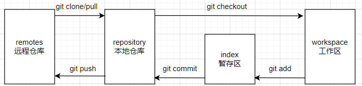

# git的相关概念

## 什么是Repository

一个仓库(Repository) 可以理解为管理一个项目的文件夹，只不过里面有一些配置文件，这些配置文件用于对项目进行版本控制。

## git和github的关系

github是项目的托管平台，只支持git作为唯一的版本库格式进行托管。

要注意git和github并不是密不可分，可以理解为git是一个软件，用于管理项目仓库；而github是在git的基础上建立的。github只能使用git，但是git可以应用于其他支持git的项目托管平台，比如gitee。

## git bash与cmd

git bash封装了cmd，并在此基础上加了bash环境的环境变量。

但是在封装的过程中，windows可能对调用自己cmd命令行控件的第三方应用设了限制，因此git bash在绝大多数情况下可以像普通cmd一样使用。

## git clone与下载zip的区别

下载zip会默认下载master主版本工程文件，下载后的文件夹为name-master，而git clone不会有。

使用git clone下载时会现在本地初始化git项目文件，这也是比直接下载zip文件多出的一个.git文件夹。

就是通过这个多出的.git文件夹可以修改源码后重新往github提交，而直接下载zip的工程文件没办法提交了。

所以如果直接使用从github上下载的东西而不push上去的话，两种方法都可以。

## git的三个工作区域

工作目录、暂存区、本地仓库、(远程的git仓库)

**工作区(workspace)**：平时存放代码的地方
**暂存区(index/stage)**：临时存放改动，事实上只是一个文件。
**本地仓库(repository)**：最终确定的文件保存到仓库，成为一个新的版本，并且对他人可见。
**远程仓库(remote)**：代码托管的远程服务器

## git中文件的4中状态

> **untracked**：未跟踪，此文件在文件夹中，但没有添加到git库，不参与版本控制。
> 通过git add 状态变为staged。

>**staged**：暂存状态，执行git commit将修改同步到库中。
>这时由于库中文件和本地文件一致，文件变为unmodify状态
>执行`git reset HEAD filename`取消暂存，文件变为modified

>**unmodify**：文件已入库，未修改，即版本库中文件内容与文件夹中完全一致。
>如果被修改则变为modified

>**modified**：文件已修改，并没有进行其他此操作。
>这个文件有两个方向：
>通过git add进入staged暂存状态，
>使用git checkout 则丢弃修改，返回unmodify状态。
>git checkout是从库中取文件，覆盖当前修改

## git的配置文件

查看系统配置`git config --system --list `
查看用户配置`git config --global --list`

系统配置文件所在位置`安装位置/etc/gitconfig`
用户配置文件所在位置`C:/Users/jgc/.gitconfig`

# 向仓库中添加文件流程

查看文件状态
`git status 文件名`
添加文件到暂存区
`git add 文件名`
提交暂存区内容到本地仓库
`git commit -m "提交描述" 文件名`

# 使用git从github上clone项目并修改后push回去的流程

## 安装完git后配置用户名

配置用户名`git config --global user.name "用户名"`

配置邮箱`git config --global user.email "邮箱"`

> 注意这里的用户名和邮箱只是起到一个区分身份的作用，可以随便填写。

## 配置免密登录

本地生成rsa密钥对`ssh-keygen -t rsa -C "邮箱"`

> -C是comment的缩写
> -C表示提供一个注释，用于识别这个密钥。因为邮箱地址具有唯一性所以一般用来识别密钥

查看生成的公钥`cat ~/.ssh/id_rsa.pub`在github添加SSH公钥

测试是否添加成功`git remote -v`，如果没报错，说明添加成功。

> 刚配置好时没有内容，可以手动添加默认的或者自定义的远程链接的别名，也可以等第一次push到github的时候git将仓库链接自动添加到origin别名里。
>
> 添加远程关联`git remote add 关联名 https://仓库链接`
>
> 查看远程关联信息`git remote -v`	
>
> 删除远程关联`git remote rm 关联名`
>
> push到github`git push 关联名 当前本地分支名`

## 拉取仓库

在github上创建一个仓库之后，就可以用`git clone url`将这个仓库完整的拉取下来。

然后进入此项目目录中进行修改，修改完后要同步到github上，就要进行下面的操作。

本地修改完后，可以先查看改动的未缓存的部分`git diff 文件名`

先将本地的修改同步到暂存区`git add .`

然后将暂存区的更新同步到本地仓库`git commit -m "注释描述" 文件名(可选项)`

最后将本地仓库push到github上，`git push`或者`git push 关联名 本地当前分支名`

之后如果从github网页端更新了某个版本，想要再单独拉去这个版本到本地，只需要`git pull 关联名 github上的分支名`

> git add时报错warning: LF will be replaced by CRLF in 解决办法
>
> windows中的换行符为 CRLF， 而在linux下的换行符为LF，git为了解决跨平台开发的换行问题，提供了`自动换行转换`，这个功能是默认处于”自动模式“即开启状态的。这样在`git add`的时候即便没有修改内容，由于转换换行的原因，git也会认为你修改过内容，所以会提示warning。但是没有任何关系。

# git的版本控制

查看版本历史记录`git reflog`，更详细的信息用`git log`

可以使用`git reset --hard 版本id`来切换项目的版本。注意`--hard`的作用是同时作用于工作区和暂存区。

> git切换版本的原理，底层其实是移动HEAD指针。
> 可以看本地的`.git`目录下的`HEAD`文件，可以看到里面指针指向`refs/heads/master`，说明当前是在`master`分支上。然后查看指针指向的文件，里面保存的就是当前的版本id。

# git的分支

查看分支`git branch -v`

创建分支`git branch 分支名`

切换分支`git checkout 分支名`

合并分支`git merge 分支名`，注意如果要将一个分支合并到主分支上，需要先checkout到主分支上，再进行merge。

> 切换分支本质上也是修改的HEAD指针。

